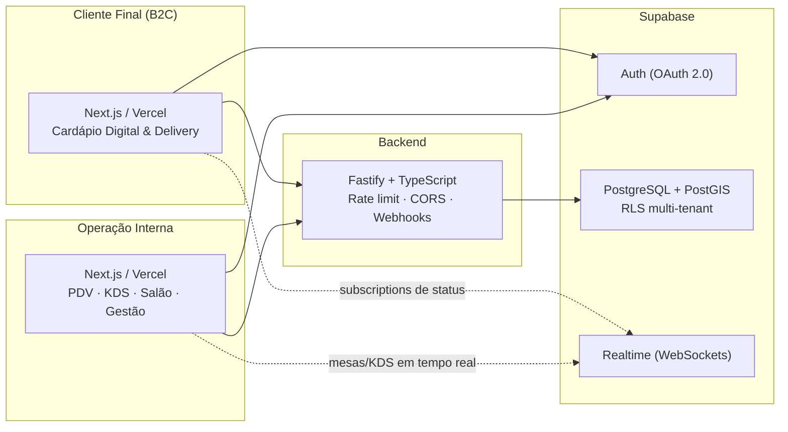

# Arquitetura do Sistema

## Visão Geral

SaaS multi-tenant para o setor gastronômico, com arquitetura **modular (DDD leve)**: módulos de domínio bem separados compartilhando um núcleo de tenancy, identidade e catálogo.

## Módulos de Domínio

| Módulo | Responsabilidade |
|---|---|
| Core / Tenancy | `tenants`, `users` (staff), `roles` (RBAC granular) |
| Catálogo & Insumos | `products`, ficha técnica, estoque/lotes, fornecedores |
| Operação | mesas/setores, comandas, KDS |
| B2C | `customers`, `customer_addresses`, carrinho, fidelidade, NPS |
| Vendas | `orders`, `order_items`, rastreamento de status |
| Financeiro | PDV/caixa, pagamentos online, contas, DRE/CMV |
| Fiscal | integração NFC-e / NF-e |

## Estratégia Multi-tenant

1. **`tenant_id` em toda tabela de domínio** (uuid, FK para `tenants`).
2. **RLS em todas as tabelas.** O isolamento acontece no banco:
   - **Staff**: o JWT do Supabase Auth carrega `app_metadata.tenant_id` (setado pelo backend com `service_role` no onboarding do funcionário). A função `public.current_tenant_id()` lê esse claim e as políticas comparam com a coluna `tenant_id`.
   - **Cliente B2C**: acesso apenas às próprias linhas (`auth_user_id = auth.uid()`), independente de tenant — um mesmo usuário Google pode ser cliente de vários restaurantes (uma linha em `customers` por tenant).
   - **Anônimo**: leitura pública somente de cardápio (`tenants` e `products` ativos) para o cardápio digital funcionar sem login.
3. **`service_role`** (backend Fastify) ignora RLS — usado para rotinas administrativas, webhooks de pagamento e onboarding.

## Decisões Estruturais

- **PostGIS** (`geography(Point, 4326)`): distância cliente→restaurante para taxa de entrega por raio e para o modo retirada (rotas Google Maps/Waze).
- **Snapshots em pedidos**: `orders.delivery_address` (jsonb) e `order_items.product_name`/`unit_price` congelam os dados no momento da venda — alterações posteriores de cadastro não reescrevem histórico.
- **Numeração de pedido por tenant**: contador transacional por tenant (`tenant_counters` + `next_order_number()`), gerando sequência amigável e sem colisão entre estabelecimentos.
- **Realtime**: as subscriptions do Supabase dependem das políticas de `select` — o cliente só recebe eventos dos próprios pedidos; o KDS só recebe eventos do próprio tenant.
- **Contratos estáveis**: funções SQL e endpoints têm contratos de entrada/saída imutáveis (ver [regras de engenharia](engineering-rules.md)).

## Roadmap (Features)

Todas as seis features foram entregues e mescladas na `main`:

1. **Fundação** — DB core + RLS/PostGIS · Backend Fastify · Frontend Next.js (PR #5)
2. **Cardápio Digital & Delivery B2C** (PR #13)
3. **Produtos & Insumos** — ficha técnica, estoque FIFO/FEFO (PR #19)
4. **Operação Interna** — mesas, comandas, KDS, RBAC (PR #25)
5. **Financeiro & Caixa** — PDV, pagamentos on-line, DRE/CMV (PR #31)
6. **Fiscal & Tributário** — configuração tributária, fila de emissão

O estado de verificação de cada módulo — o que está testado e o que **não** foi
homologado contra ambientes reais — está no [README](../README.md#o-que-está-verificado-e-o-que-não-está).
