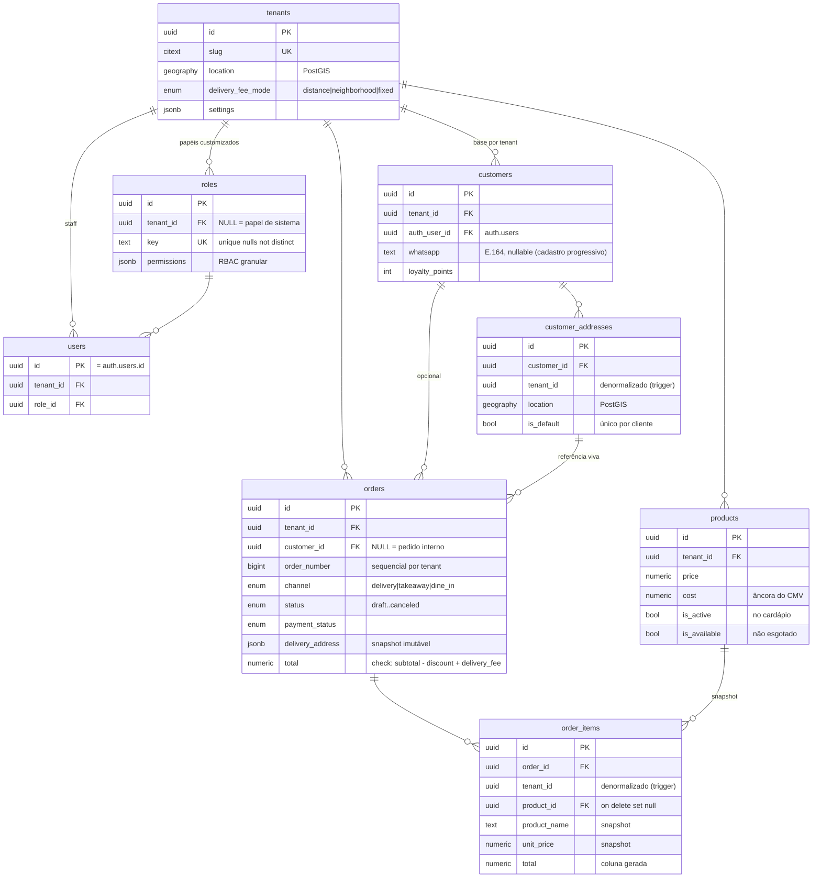

# PBI 1 — Database Core & B2C

> Issue: [#2](https://github.com/AlexsanderVargas/vendas-bot/issues/2) · Feature: [#1](https://github.com/AlexsanderVargas/vendas-bot/issues/1)

Scripts em `supabase/migrations/`, na ordem de dependência:

| Migration | Conteúdo |
|---|---|
| `20260818000001_extensions.sql` | `postgis`, `pg_trgm`, `citext` (schema `extensions`) |
| `20260818000002_helpers.sql` | `set_updated_at()`, `current_tenant_id()` |
| `20260818000003_core_tenancy.sql` | `tenants`, `roles` (+seeds), `users`, `is_staff_of()` |
| `20260818000004_catalog.sql` | `products` |
| `20260818000005_customers.sql` | `customers`, `customer_addresses` |
| `20260818000006_orders.sql` | `orders`, `order_items`, `tenant_counters`, `next_order_number()` |
| `20260818000007_rls.sql` | RLS de todas as tabelas + triggers de integridade + Realtime |

## Diagrama ER



## Decisões de projeto

### Multi-tenancy e claims JWT
- Todo isolamento de staff usa o claim **`app_metadata.tenant_id`** do JWT. O backend (PBI 2), com `service_role`, grava o claim via Admin API (`auth.admin.updateUserById(id, { app_metadata: { tenant_id } })`) no onboarding do funcionário. `app_metadata` não é editável pelo usuário final — diferente de `user_metadata`.
- `current_tenant_id()` retorna `null` para clientes B2C e anônimos, então as condições de staff simplesmente não casam — sem branch especial.
- Clientes B2C acessam pelas próprias linhas (`auth_user_id = auth.uid()`); um mesmo login social pode ser cliente de N restaurantes (uma linha em `customers` por tenant).

### Otimizações aplicadas
- **Initplan caching**: toda chamada `auth.uid()` / `current_tenant_id()` nas políticas está envolvida em `(select ...)` — o Postgres avalia 1x por statement em vez de 1x por linha (recomendação oficial do Supabase para RLS em escala).
- **Uma política permissiva por ação/tabela** (condições OR internas) — múltiplas políticas permissivas degradam o planner.
- **Índices compostos com `tenant_id` na frente** em todos os caminhos quentes: `orders (tenant_id, status, created_at)` (KDS), `orders (tenant_id, created_at desc)` (histórico), `products (tenant_id, sort_order) where is_active` (cardápio, índice parcial).
- **GIST** em `geography` (tenants e endereços) para `ST_DWithin`/`ST_Distance`; **GIN trigram** em `products.name` para busca fuzzy.
- `order_items.total` é **coluna gerada** — consistência aritmética garantida pelo banco, sem trigger.
- `tenant_id` **denormalizado** em `customer_addresses` e `order_items`, preenchido por trigger a partir do pai (nunca confiado ao cliente) — políticas de staff ficam sem join.

### Numeração de pedidos por tenant
`tenant_counters` + `next_order_number(uuid)` (SECURITY DEFINER, upsert atômico). Trigger `orders_assign_number` preenche `order_number` no insert. Vantagens sobre sequence global: números amigáveis por estabelecimento e a mesma infraestrutura serve comandas/fiscal no futuro. O `EXECUTE` da função é revogado de `anon`/`authenticated` — só o trigger a usa.

### Snapshots imutáveis em vendas
- `orders.delivery_address` (jsonb) congela o endereço no momento do pedido; `delivery_address_id` mantém a referência viva com `on delete set null`.
- `order_items.product_name` e `unit_price` congelam o item; `product_id` usa `on delete set null` — apagar produto não apaga histórico de venda.

### Segurança em profundidade
- `tenant_counters` tem RLS habilitada **sem políticas** (deny all fora do `service_role`).
- Clientes só atualizam `name` e `whatsapp` em `customers` (grants de coluna); `loyalty_points` e `whatsapp_verified_at` são exclusivos do backend.
- Cliente só insere pedido próprio, no próprio tenant, com `status in ('draft','placed')` e `payment_status = 'pending'`; itens só em pedido próprio ainda não confirmado. Transições de status e pagamento passam pelo backend.
- Funções com `search_path = ''` e nomes totalmente qualificados (lint do Supabase para SECURITY DEFINER).

### Realtime
`orders` e `order_items` entram na publicação `supabase_realtime` (guardado por `DO` block para rodar fora do Supabase). As políticas de `SELECT` governam o que cada subscription recebe: cliente vê só os próprios pedidos; KDS vê só o tenant.

## Contratos estáveis (regra 5)

| Função | Contrato |
|---|---|
| `set_updated_at()` | trigger BEFORE UPDATE → `NEW.updated_at = now()` |
| `current_tenant_id()` | `() -> uuid \| null` |
| `is_staff_of(uuid)` | `(tenant_id) -> boolean` |
| `next_order_number(uuid)` | `(tenant_id) -> bigint` (atômico) |
| `assign_order_number()` | trigger BEFORE INSERT em `orders` |
| `sync_address_tenant()` / `sync_order_item_tenant()` | triggers BEFORE INSERT/UPDATE — derivam `tenant_id` do pai |

## Como aplicar

```bash
supabase db push          # via CLI vinculada ao projeto
# ou: SQL Editor do dashboard, executando os arquivos na ordem numérica
```

## Verificação local

As migrations foram validadas em PostgreSQL + PostGIS descartável com stub do schema `auth` (`auth.users`, `auth.uid()`, `auth.jwt()`) — ver relatório na issue #2.
